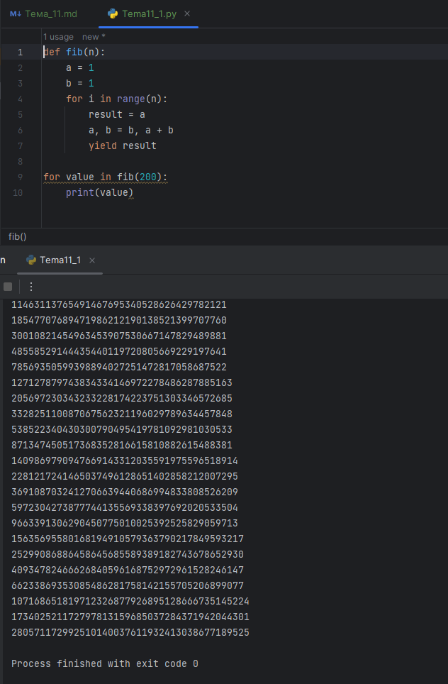
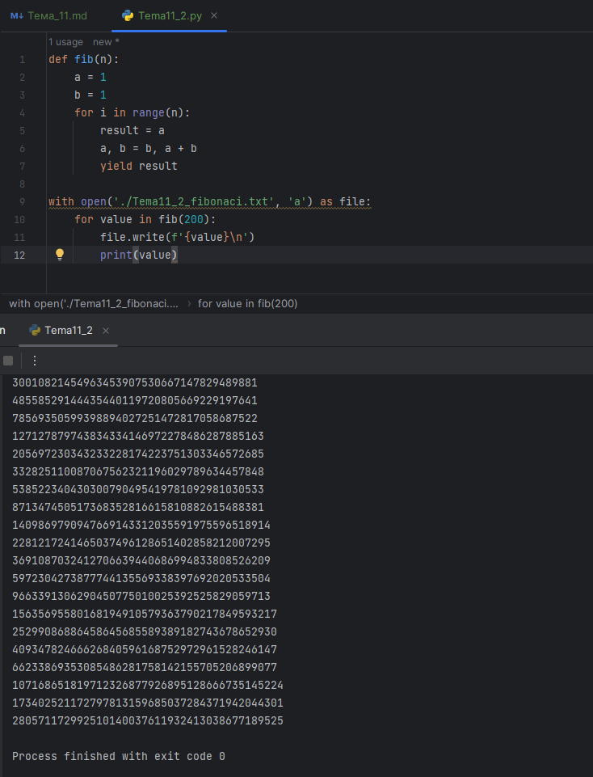
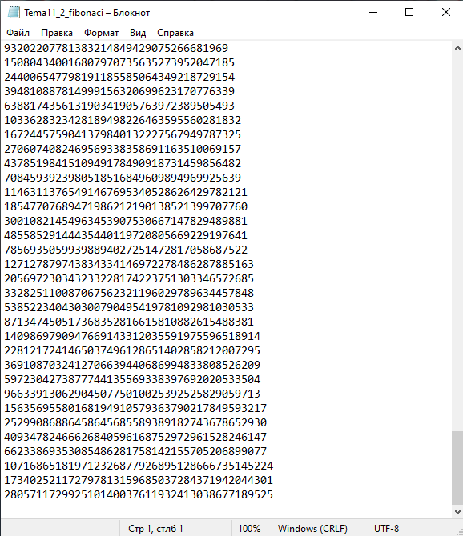

# Тема 11. Итераторы и генераторы
Отчет по Теме #11 выполнил(а):
- Долматов Никита Алексеевич
- ЗПИЭ-20-1

| Задание   | Сам_раб |
|-----------|---------|
| Задание 1 | +       |
| Задание 2 | +       |

знак "+" - задание выполнено; знак "-" - задание не выполнено;

Работу проверили:
- к.э.н., доцент Панов М.А.

## Самостоятельная работа №1
### Вас никак не могут оставить числа Фибоначчи, очень уж они вас заинтересовали. Изучив новые возможности Python вы решили реализовать программу, которая считает числа Фибоначчи при помощи итераторов. Расчет начинается с чисел 1 и 1. Создайте функцию fib(n), генерирующую n чисел Фибоначчи с минимальными затратами ресурсов. Для реализации этой функции потребуется обратиться к инструкции yield (Она не сохраняет в оперативной памяти огромную последовательность, а дает возможность “доставать” промежуточные результаты по одному). Результатом решения задачи будет листинг кода и вывод в консоль с числом Фибоначчи от 200.

```python
def fib(n):
    a = 1
    b = 1
    for i in range(n):
        result = a
        a, b = b, a + b
        yield result

for value in fib(200):
    print(value)
```

### Результат.



## Выводы

При помощи генераторов можно написать более эффективную функцию для расчёта числа Фибоначи

## Самостоятельная работа №2
### К коду предыдущей задачи добавьте запоминание каждого числа Фибоначчи в файл “fib.txt”, при этом каждое число должно находиться на отдельной строчке. Результатом выполнения задачи будет листинг кода и скриншот получившегося файла

```python
def fib(n):
    a = 1
    b = 1
    for i in range(n):
        result = a
        a, b = b, a + b
        yield result

with open('./Tema11_2_fibonaci.txt', 'a') as file:
    for value in fib(200):
        file.write(f'{value}\n')
        print(value)
```

### Результат.




## Выводы

Добавлена запись числа Фибоначи в файл

## Общие выводы по теме

Итераторы и генераторы в Python являются мощным инструментом, который позволяет:
1. Улучшать читаемость кода
2. Писать более производительный код
3. Потреблять меньше ресурсов